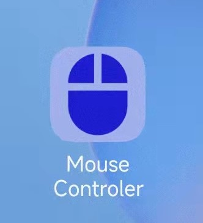
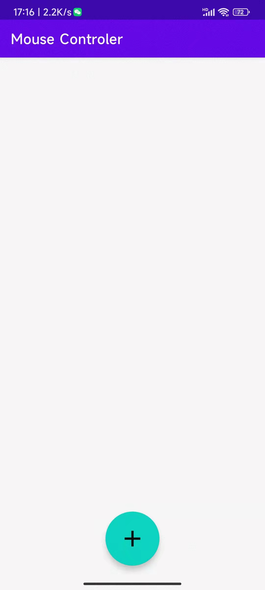
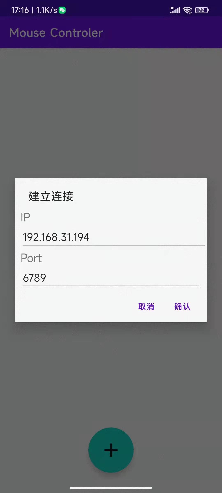
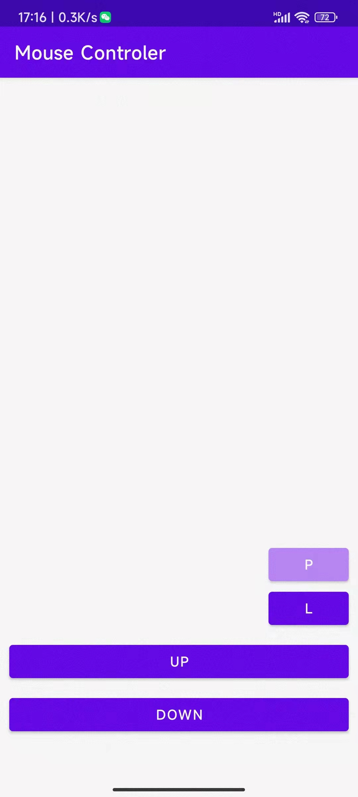

# Mouse Controler

> 鼠标控制器

## 实现功能

- 手机触屏控制电脑鼠标，包括
  - 鼠标移动（手指在触屏手机端移动）
  - 左键/右键点击（手指敲击屏幕）
  - 按住左键拖动
  - 滚轮上下滑动

## 程序展示和说明

- 图标

- 点击图标后界面

- 点击最下端的连接按钮

- 输入IP和端口号后点击确认进入操作界面

- 此时在空白区域滑动即可控制鼠标移动，按钮说明如下
  - 从上到下，第一个按钮为是否拖动按钮，按下后进入拖动模式（PUSH），释放后进入自由模式（RELEASE）；拖动模式下，从手指接触屏幕开始至结束，鼠标左键一直处于按下状态；自由模式下，鼠标左键处于释放状态
  - 第二个按钮为是否左键按钮，按下可切换状态，显示“L”时，手指轻触屏幕，会按下左键；显示“R”时，下一次手指轻触屏幕会按下右键，随即恢复至左键模式
  - 第三个按钮为向下滑动页面（显示上面的内容）
  - 第四个按钮为向上滑动页面（显示下面的内容）

## 环境需要

- PC端需要**JRE**运行jar文件
- 移动端需要**Android**系统手机安装apk文件
- PC端和移动端需要在同一局域网下（连接同一路由器或其他）
- 移动端需要得到PC端的IP和端口，其中在运行jar文件时会输出监听的端口号，IP地址可以通过在PC端CMD运行ipconfig获得当前局域网的IP

## 配置文件

> PC端jar包同目录下有config.properties配置文件，该配置文件为程序执行的必需文件，不要修改属性名称或删去属性

可以配置的参数有

- PC端分辨率(height&width)
  - 例如1920x1080，即可配置为height=1080,width=1920
- 端口号(port)
  - 例如6789，即可配置为port=6789
- PC端输出的详细程度(verbose)
  - verbose=0 只输出执行的操作
  - verbose=1 除了输出操作外还输出实时的鼠标坐标
- 滚轮的灵敏度(sensibility)
  - 值越大越灵敏
- 是否启用Nagle's algorithm (ifon)
  - ifon=true 启用
  - ifon=false 不启用

## 算法

- 移动端手指接触屏幕移动的相对位置等于PC端鼠标移动的相对位置
- PC端和移动端通过建立TCP连接进行通信，并约定好通信格式

## 目录说明

- “PC端jar包” 为PC端可执行程序
- “移动端apk”为移动端app安装所需apk
- “src”包括PC端和移动端源码
- “pic”为README.md引用的图片
